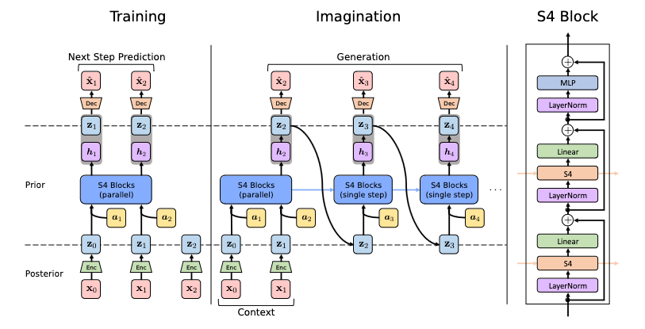

# Structured State Space Sequence World Models (S4WM)

S4WM, first introduced in https://arxiv.org/pdf/2307.02064.pdf attempts to model the dynamics of an environment in a compact latent space.

*Figure from https://arxiv.org/pdf/2307.02064.pdf*

The base implementation of the s4 sequence model (s4_nn.py/s4_ssm.py) started as an adaptation of the code in https://github.com/srush/annotated-s4, which is the codebase for the great blog post https://srush.github.io/annotated-s4/.
