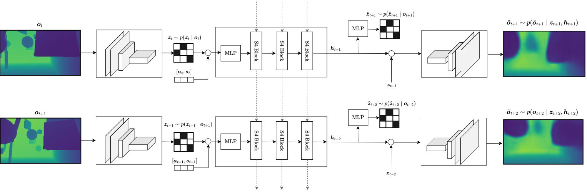

# Structured State Space Sequence World Model (S4WM)

TODO: Create proper README

*The base implementation of S4 started out as an adaptation of the code in the great blog post https://srush.github.io/annotated-s4/*

*Learning environment dynamics in a compact latent space*
